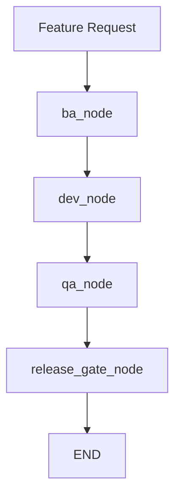

# AI SDLC Agent with LangGraph

An end-to-end AI-driven SDLC orchestration project built progressively using LangChain and LangGraph.

This project started as a simple ReAct-style AI SDLC agent with BA, DEV, and QA tools, then evolved into:
1. a context-aware enhanced agent with shared SDLC state, and
2. a full custom LangGraph `StateGraph` workflow with explicit nodes such as `ba_node`, `dev_node`, `qa_node`, and `release_gate_node`.

---

## Project Goals

The objective of this project is to simulate an AI-powered Software Development Life Cycle pipeline that can:

- Gather business requirements.
- Create user stories and sprint scope.
- Generate development scaffolding.
- Review generated code.
- Build QA test plans.
- Simulate QA execution.
- Make a release gate decision.

This helps demonstrate how agentic workflows can support structured SDLC automation.

---

## Project Evolution

### 1. Initial AI SDLC Agent

The first version used a ReAct-style orchestration pattern with tools for:

- **BA**
  - Gather requirements
  - Create user stories
- **DEV**
  - Generate code scaffold
  - Review code
- **QA**
  - Generate test cases
  - Run test execution simulation

This version followed a sequential reasoning flow and produced a final SDLC summary.

---

### 2. Enhanced Context-Aware Agent

The second version improved the architecture by introducing a shared `SDLC_CONTEXT` object.

#### Key improvements
- All tools read from and write to a shared state.
- Context persisted across BA, DEV, and QA steps.
- The agent no longer depended only on prompt chaining.
- A final summary tool was added to provide a single source of truth.

#### Benefits
- Easier debugging
- Better extensibility
- Reduced prompt drift
- More aligned with stateful LangGraph workflows

---

### 3. Full Custom LangGraph StateGraph

The final version replaced the generic ReAct loop with an explicit `StateGraph` workflow.

#### Explicit nodes
- `ba_node`
- `dev_node`
- `qa_node`
- `release_gate_node`

#### Shared typed state
The system uses a typed state object to track:

- `feature_request`
- `requirements`
- `user_stories`
- `code_scaffold`
- `code_review`
- `test_plan`
- `test_execution`
- `defects`
- `release_decision`
- `next_step`
- `history`

#### Workflow path

```text
ba_node -> dev_node -> qa_node -> release_gate_node -> END
```

This version is more deterministic, testable, and enterprise-friendly.

---

## Files

### `ai_sdlc_agent.py`
Baseline AI SDLC agent using a ReAct-style LangGraph setup.

### `ai_sdlc_agent_enhanced.py`
Enhanced version with shared SDLC context updates across BA, DEV, and QA stages.

### `ai_sdlc_stategraph.py`
Full custom LangGraph `StateGraph` implementation with explicit workflow nodes and typed state.

---

## Architecture

## ReAct-style version

```text
User Request
   ↓
AI Agent
   ↓
BA Tools → DEV Tools → QA Tools
   ↓
Final SDLC Report
```

## Enhanced context-aware version

```text
User Request
   ↓
Shared SDLC Context
   ↓
BA Tools → DEV Tools → QA Tools
   ↓
Context Summary
   ↓
Final SDLC Report
```

## Full StateGraph version

```text
Initial State
   ↓
ba_node
   ↓
dev_node
   ↓
qa_node
   ↓
release_gate_node
   ↓
END
```

---

## Features

- AI-assisted business analysis
- User story generation with story points
- Python service scaffold generation
- Structured code review simulation
- QA test planning
- QA defect simulation
- Release gate decisioning
- Shared context/state tracking
- Explicit graph-based orchestration

---

## Example Use Case

### Input feature request

```text
Build a user authentication module with login, registration, and password reset functionality
```

### Output produced by the system

- Requirements document
- User stories with sprint scope
- Python code scaffold
- Code review summary
- QA test plan
- QA execution report
- Defect log
- Final release decision

---

## Sample Release Gate Logic

The `release_gate_node` evaluates defects and decides release status using simple governance rules:

- If any **High severity** defect exists → `NOT_APPROVED`
- If only lower severity defects exist → `CONDITIONAL_APPROVAL`
- If no defects exist → `APPROVED`

This simulates a lightweight enterprise release control process.

---

## Sample Defects

Example simulated defects generated during QA:

- `DEF-001` — High — Missing required field causes incorrect server-side failure behavior.
- `DEF-002` — Medium — Empty string payload values are not sanitized consistently.

These defects drive the final release decision.

---

## Requirements

Install the following Python packages:

```bash
pip install langchain langchain-core langchain-openai langgraph
```

You will also need an API key for your language model provider:

```bash
export OPENAI_API_KEY="your-api-key"
```

---

## Running the Project

### Run the basic ReAct version

```bash
python ai_sdlc_agent.py
```

### Run the enhanced context-aware version

```bash
python ai_sdlc_agent_enhanced.py
```

### Run the full StateGraph version

```bash
python ai_sdlc_stategraph.py
```

---

## Output Behavior

The scripts print:

- final SDLC report
- generated BA/DEV/QA artifacts
- release decision
- defect list
- state history
- raw final state object

This makes the workflow easy to inspect for debugging and demonstration.

---

## Why StateGraph is Better

The full `StateGraph` version is the strongest design for this project because it offers:

- explicit workflow stages
- typed shared state
- predictable execution paths
- easier governance modeling
- easier conditional routing
- easier retry/loop design
- better maintainability for enterprise SDLC automation

Compared with a generic tool-calling loop, the graph design is more suitable when stage ownership and transition control matter.

---

## Recommended Next Enhancements

### 1. Add retry loops
Allow the graph to route from QA back to DEV when defects are detected:

```text
qa_node -> dev_node -> qa_node
```

### 2. Add more governance nodes
Possible next nodes:
- `security_review_node`
- `uat_approval_node`
- `jira_sync_node`
- `github_pr_node`
- `deployment_node`
- `rollback_node`

### 3. Replace mock outputs with real integrations
Connect the workflow to:
- Jira
- GitHub
- Confluence
- Test automation tools
- CI/CD pipelines

### 4. Add Mermaid visualization
Generate a Mermaid diagram for graph inspection and documentation.

### 5. Add persistence
Persist SDLC state to JSON, a database, or a workflow store.

---

## Example Mermaid Diagram



---

## Design Notes

This project demonstrates three important patterns in agentic engineering:

### ReAct orchestration
Useful for flexible tool-driven reasoning.

### Shared context/state
Useful for preserving cross-step business context.

### Explicit workflow graphs
Best for governed, repeatable enterprise processes.

Together, these patterns form a strong foundation for AI-assisted SDLC automation.

---

## Intended Audience

This project is useful for:

- AI/ML engineers
- technical project managers
- solution architects
- business analysts
- QA leads
- engineering managers
- enterprise automation teams

It is especially relevant for teams exploring agentic workflows for SDLC, governance, and delivery automation.

---

## Limitations

Current versions use simulated outputs for:

- requirements
- code generation
- QA execution
- release governance

This means the project is best viewed as a workflow prototype or accelerator rather than a production-ready delivery engine.

---

## Summary

This project progressively evolves from:
- a simple AI SDLC agent,
- to a context-aware orchestration model,
- to a full workflow-driven `StateGraph` architecture.

It demonstrates how LangGraph can be used not just for conversational agents, but for structured enterprise process orchestration across BA, DEV, QA, and release governance.

---

## Authoring Direction

This repository is ideal as a starting point for:
- AI SDLC copilots
- agentic PMO assistants
- delivery governance bots
- requirement-to-release automation systems
- enterprise workflow orchestration using LLMs
